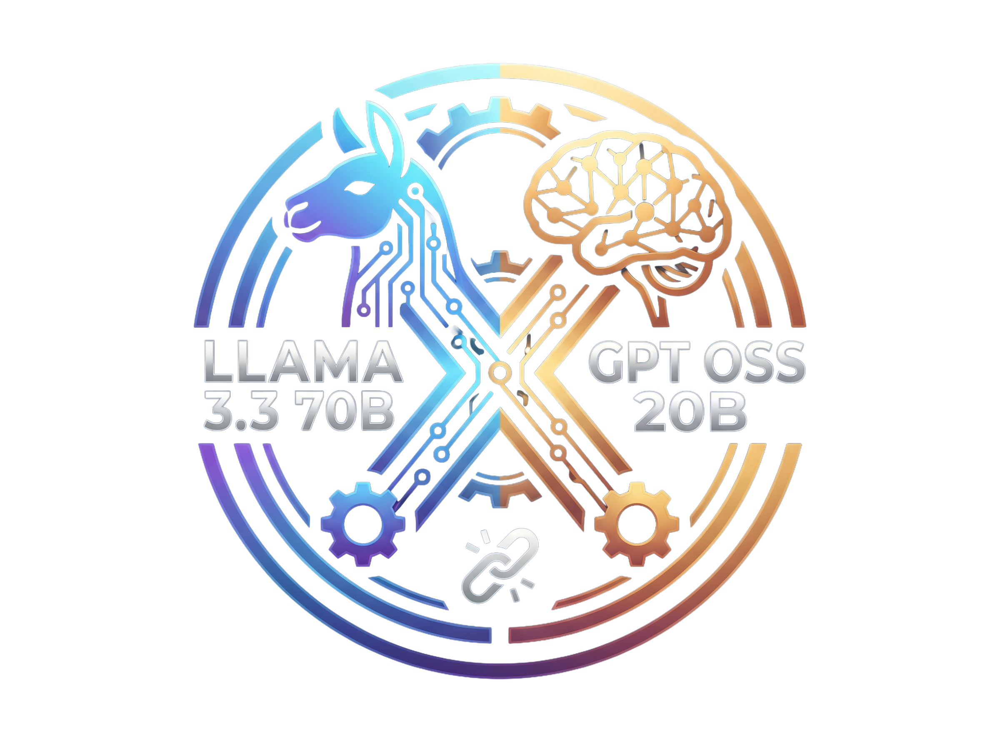

<p align="center">
  
  <h1 align="center">Jack AI — Vibe Coding Platform</h1>
  <p align="center">
    An AI-powered, full-stack vibe coding platform. Describe what you want to build — the AI agent writes the code, spins up a sandbox, and gives you a live preview.
  </p>
  <p align="center">
    Built by <strong>Jack Obito</strong> · BCA Student @ TCET Mumbai
  </p>
</p>

---

## ✨ What is this?

This is a **monorepo** (forked from Vercel Examples) containing a production-grade AI coding assistant app at `apps/vibe-coding-platform`. You type a prompt, the AI agent generates a full-stack application inside a secure sandboxed environment, with real-time logs, file explorer, and live preview — all in the browser.

[](https://vercel.com/new/clone?demo-description=A+full-stack+coding+platform+built+with+Vercel%27s+AI+Cloud%2C+AI+SDK%2C+and+Next.js.&demo-title=Vibe+Coding+Platform&repository-url=https%3A%2F%2Fgithub.com%2FJackByteBack%2Fai-chatbot&project-name=jack-ai&repository-name=jack-ai&from=vibe-coding-platform-app)

---

## 🚀 Features

| Feature | Description |
|---|---|
| 🤖 **Multi-Model AI** | Switch between Claude, GPT, Llama, DeepSeek, Kimi, and more |
| 🏖️ **Live Sandbox** | Secure code execution via Vercel Sandbox with live preview |
| 📁 **File Explorer** | Browse and inspect all generated project files |
| 📋 **Command Logs** | Real-time terminal output from the sandbox |
| 🛠️ **Error Monitor** | Detects and auto-fixes runtime errors |
| ⚡ **One-Click Deploy** | Deploy any generated app directly to Vercel |
| 🎛️ **Reasoning Control** | Adjustable reasoning effort (low / medium / high) |

---

## 🧠 Supported Models

| Model | Provider |
|---|---|
| Claude Opus 4.6 | Anthropic |
| GPT 5.4 | OpenAI |
| Llama 3.3 70B *(default)* | Meta |
| DeepSeek V4 Pro | DeepSeek |
| Kimi K2.6 | Moonshot AI |
| MiniMax M2.7 | MiniMax |
| Qwen 2.5 72B | Alibaba |
| GLM 5.1 | Zhipu AI |
| Gemma 4 31B | Google |
| GPT OSS 20B | OpenAI |

---

## 🗂️ Repo Structure

```
ai-chatbot/
├── apps/
│   └── vibe-coding-platform/     ← ✅ Main app (start here)
│       ├── ai/                   # AI tools, gateway, model config
│       ├── app/                  # Next.js App Router pages
│       ├── components/           # UI components (chat, preview, logs…)
│       └── .env.example          # Required environment variables
├── app-directory/
│   └── jack/                     # Minimal Next.js demo scaffold
├── solutions/                    # Vercel example solutions
├── start.md                      # Local dev guide & debugging notes
├── mind map.md                   # Project navigation quick-reference
└── README.md                     ← You are here
```

---

## ⚙️ Getting Started (Local)

### Prerequisites

- **Node.js** `24.x` — required by the vibe platform
- **pnpm** `9.x` — repo uses pnpm workspaces

```bash
# Install Node 24 (macOS/Homebrew)
brew install node@24
export PATH="/opt/homebrew/opt/node@24/bin:$PATH"
```

### 1. Install dependencies

```bash
# From repo root
HUSKY=0 pnpm install --force
```

> `HUSKY=0` avoids errors if the `.git` directory isn't in the expected location.

### 2. Set up environment variables

```bash
cd apps/vibe-coding-platform
cp .env.example .env.local
```

Fill in your API keys in `.env.local`:

```env
AI_GATEWAY_API_KEY=your_vercel_ai_gateway_key
ANTHROPIC_API_KEY=your_anthropic_key
OPENAI_API_KEY=your_openai_key
DEEPSEEK_API_KEY=your_deepseek_key
KIMI_API_KEY=your_kimi_key
# ... see .env.example for full list
```

### 3. Run the app

```bash
cd apps/vibe-coding-platform
pnpm dev
```

Open [http://localhost:3000](http://localhost:3000) — if port 3000 is busy, Next.js will pick the next available port.

---

## 🛠️ Debugging

### Quick health check

```bash
curl -I http://localhost:3000
```

### Debug server-side code (API routes / Server Components)

```bash
NODE_OPTIONS="--inspect=9229" pnpm dev
```

Then attach a debugger:
- **Chrome**: `chrome://inspect` → "Open dedicated DevTools for Node"
- **VS Code**: add a `Node: Attach` config pointing to port `9229`

### Debug client-side (React)

Use browser DevTools → Sources tab, or add `debugger;` / `console.log()` statements.

### Common issues

| Problem | Fix |
|---|---|
| `ERR_CONNECTION_REFUSED` | Server isn't running — `cd apps/vibe-coding-platform && pnpm dev` |
| `engines` mismatch on root `pnpm dev` | Run from `apps/vibe-coding-platform` directly, not repo root |
| Install fails behind proxy | Unset proxy vars: `env -u ALL_PROXY -u HTTPS_PROXY HUSKY=0 pnpm install --force` |
| `shiki` externalization warnings | Non-fatal — app runs fine |

---

## 🤖 Example Prompts

```
Generate a Next.js app that allows listing and searching Pokémon
Create a Golang server that responds "Hello World" to any request
Build a to-do app with local storage and dark mode
Create a weather dashboard using the OpenWeatherMap API
```

---

## 📦 Tech Stack

- [Next.js 16](https://nextjs.org) with Turbopack
- [AI SDK v6](https://ai-sdk.dev) — streaming, tool calling, multi-model
- [Vercel AI Gateway](https://vercel.com/docs/ai-gateway) — unified model API
- [Vercel Sandbox](https://vercel.com/docs/vercel-sandbox) — secure code execution
- [Tailwind CSS](https://tailwindcss.com) + [shadcn/ui](https://ui.shadcn.com)
- [TypeScript](https://typescriptlang.org)

---

## 👤 Developer

Made by **Jack Obito** (`JackByteBack`) — BCA student at **TCET Mumbai**, passionate about full-stack web development, AI tooling, and VR/XR.

- GitHub: [@JackByteBack](https://github.com/JackByteBack)

---

## 📄 License

MIT
